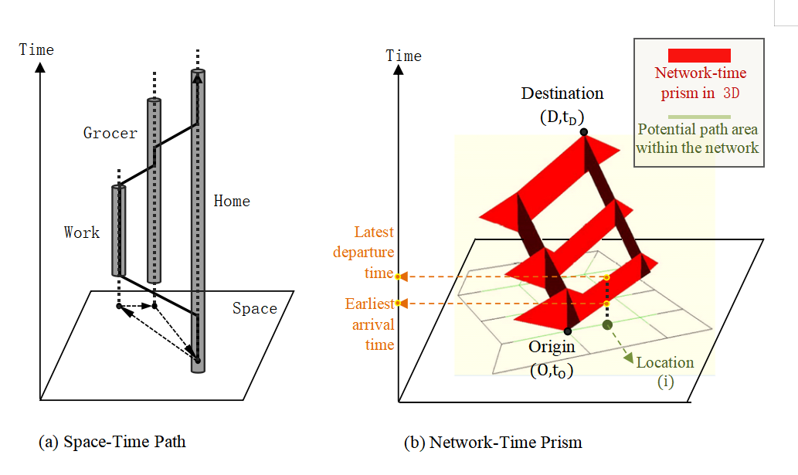
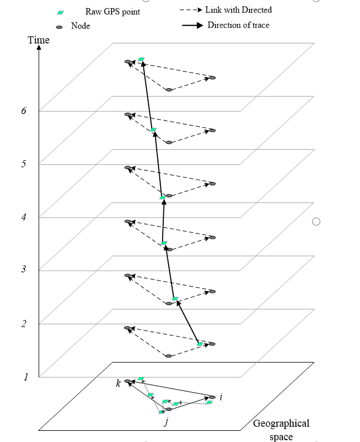
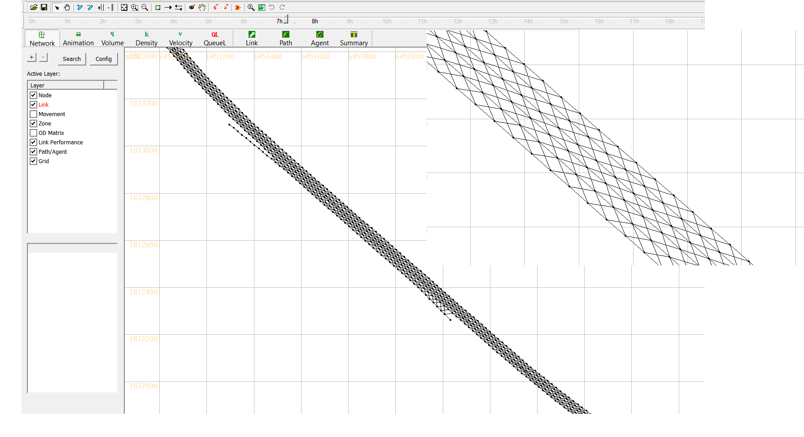

Base on the concept of space-time paths and a time geographic method, this source code is implemented by Jiawei (Jay) Lu (https://github.com/jiawei92) at Arizona State University.

Published journal paper: 
Tang, J., Song, Y., Miller, H.J. and Zhou, X., 2016. Estimating the most likely space–time paths, dwell times and path uncertainties from vehicle trajectory data: A time geographic method. Transportation Research Part C: Emerging Technologies, 66, pp.176-194.
You can find the pre-print version of this paper in doc.

Different from the traditional geometric map-matching algorithms that only map GPS samples to a sequence of physical links, our algorithm generates 
the most likely and feasible network-time paths, the expected link travel times and dwell times at possible intermediate stops. The core dynamic programming algorithm implements the model for both offline and real-time applications.

The concept of space-time path and network-time prism, figure courtesy of Dr. Harvey Miller at  Ohio State University (https://cura.osu.edu/people/miller.81) and Dr. Ying Song at  University of Minnesota (https://cla.umn.edu/about/directory/profile/yingsong).

6 GPS points on a 3-node network based on three-dimensional network

#What is GMNS?
General Travel Network Format Specification is a product of Zephyr Foundation, which aims to advance the field through flexible and efficient support, education, guidance, encouragement, and incubation.
Further Details in https://zephyrtransport.org/projects/2-network-standard-and-tools/

The underlying network uses GMNS format.

One can visualize the network and map matching result in NeXTA: https://github.com/xzhou99/NeXTA-GMNS

A related space-time network based algorithm is provided at https://github.com/xzhou99/DTW_Paper_Code using derived data from NgSIM trajectories. https://github.com/xzhou99/DTW_Vehicle_Trajectory_Data

